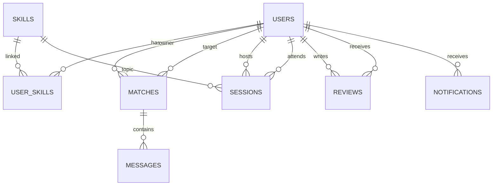

# SkillSwap

SkillSwap is a student skill exchange platform built with Laravel 12, Inertia.js, React, MySQL, Tailwind CSS, and Vite.

## Tech Stack
- Laravel 12
- React + Inertia
- MySQL
- Tailwind CSS
- Vite
- Laravel Breeze Auth

## Core Modules
- Authentication and email verification
- Profile and skill management
- Mutual skill matching engine
- Messaging between matched users
- Session scheduling
- Reviews and ratings
- Admin dashboard and moderation
- Search, filtering, sorting, and pagination

## Setup
1. `cp .env.example .env`
2. `composer install`
3. `npm install`
4. Configure database credentials in `.env`
5. `php artisan key:generate`
6. `php artisan migrate --seed`
7. `php artisan storage:link`
8. `php artisan serve`
9. `npm run dev`

## ER Diagram (Text)

## API Route Summary
- `POST /register`, `POST /login`, `POST /logout`
- `GET /profile`, `PUT /profile`
- `GET /skills`, `POST /skills`, `POST /user-skills`, `DELETE /user-skills/{id}`
- `GET /matches`, `POST /matches/refresh`
- `GET /messages/{match}`, `POST /messages`
- `GET /sessions`, `POST /sessions`, `PATCH /sessions/{session}/status`
- `GET /reviews/{user}`, `POST /reviews`
- `GET /admin/dashboard`, `PATCH /admin/users/{user}/ban`

## Suggested Folder Structure
- `app/Http/Controllers`
- `app/Http/Requests`
- `app/Repositories`
- `app/Services`
- `app/Policies`
- `app/Notifications`
- `resources/js/Components`
- `resources/js/Layouts`
- `resources/js/Pages`
- `resources/js/Hooks`
- `resources/js/Utils`

## Notes
This repository contains production-oriented architecture patterns (service and repository layer, request validation, policies, and API resources) with a modern responsive UI foundation.
