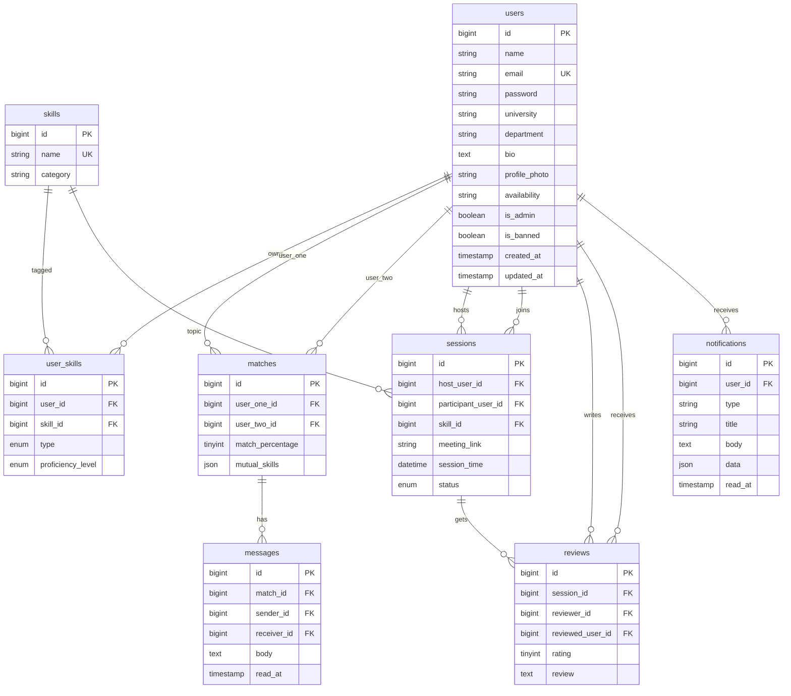

# ER Diagram

```mermaid
erDiagram
  users {
    bigint id PK
    string name
    string email UK
    string password
    string university
    string department
    text bio
    string profile_photo
    string availability
    boolean is_admin
    boolean is_banned
    timestamp created_at
    timestamp updated_at
  }

  skills {
    bigint id PK
    string name UK
    string category
  }

  user_skills {
    bigint id PK
    bigint user_id FK
    bigint skill_id FK
    enum type
    enum proficiency_level
  }

  matches {
    bigint id PK
    bigint user_one_id FK
    bigint user_two_id FK
    tinyint match_percentage
    json mutual_skills
  }

  messages {
    bigint id PK
    bigint match_id FK
    bigint sender_id FK
    bigint receiver_id FK
    text body
    timestamp read_at
  }

  sessions {
    bigint id PK
    bigint host_user_id FK
    bigint participant_user_id FK
    bigint skill_id FK
    string meeting_link
    datetime session_time
    enum status
  }

  reviews {
    bigint id PK
    bigint session_id FK
    bigint reviewer_id FK
    bigint reviewed_user_id FK
    tinyint rating
    text review
  }

  notifications {
    bigint id PK
    bigint user_id FK
    string type
    string title
    text body
    json data
    timestamp read_at
  }

  users ||--o{ user_skills : owns
  skills ||--o{ user_skills : tagged
  users ||--o{ matches : user_one
  users ||--o{ matches : user_two
  matches ||--o{ messages : has
  users ||--o{ sessions : hosts
  users ||--o{ sessions : joins
  skills ||--o{ sessions : topic
  sessions ||--o{ reviews : gets
  users ||--o{ reviews : writes
  users ||--o{ reviews : receives
  users ||--o{ notifications : receives
```
